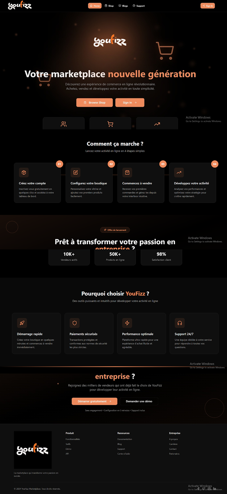
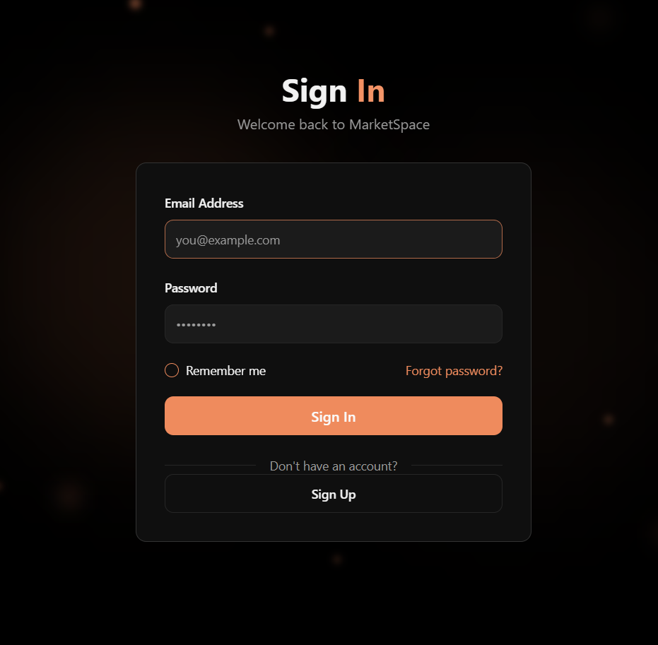

# 🛍️ YouFizz — Marketplace Nouvelle Génération

**YouFizz** est une plateforme de marketplace moderne conçue pour permettre aux vendeurs de créer leur boutique, présenter leurs produits et développer leur activité en ligne facilement.

Le projet est basé sur une architecture **Nx Monorepo** combinant une application frontend moderne avec une architecture backend **microservices basée sur NestJS**.

---

# 📸 Aperçu de l'application

## 🏠 Page d'accueil

La page d'accueil présente l'univers YouFizz, le fonctionnement de la marketplace, les fonctionnalités principales et les avantages proposés aux vendeurs.



---

## 🔐 Sign In

La page **Sign In** permet aux utilisateurs de se connecter à leur compte de manière simple et sécurisée.



---

## 📝 Sign Up

La page **Sign Up** permet aux nouveaux utilisateurs de créer leur compte et de sélectionner leur rôle.


---

## 🛒 Shop

La page **Shop** permet aux utilisateurs de découvrir les produits disponibles sur la marketplace.


---

# ✨ Fonctionnalités principales

- 🏠 **Page d'accueil dynamique**
- 🛒 **Marketplace / Shop**
- 🔐 **Authentification sécurisée**
- 📝 **Création de compte**
- 👤 **Gestion des rôles**
- 🔎 **Recherche de produits**
- 🏷️ **Filtrage du catalogue**
- 🔔 **Système de notifications**
- 🌙 **Dark Mode**
- 📱 **Design responsive**
- 🎨 **Interface UI/UX moderne**
- 🧩 **Composants réutilisables**
- 🏪 **Gestion des boutiques**
- 📦 **Gestion des produits**

---

# ⚙️ Microservices Backend

## 🌐 API Gateway

L'API Gateway constitue le point d'entrée principal des requêtes HTTP.

### Responsabilités

- Réception des requêtes HTTP
- Routage des requêtes
- Communication avec les microservices
- Centralisation des endpoints API
- Communication TCP avec les services backend

---

## 🔐 Auth Service

Le service **Auth** est responsable de l'authentification des utilisateurs.

### Fonctionnalités

- Inscription
- Connexion
- Authentification
- Gestion des sessions
- Gestion des accès
- Communication avec les autres services

---

## 👤 User Service


Le service **User** gère les données et informations des utilisateurs.

### Fonctionnalités

- Gestion des utilisateurs
- Gestion des profils
- Gestion des rôles
- Informations utilisateur
- Communication avec le service Auth

---

## 🔔 Notification Service

Le service **Notification** est responsable de la gestion des notifications.

### Fonctionnalités

- Envoi de notifications
- Gestion des événements
- Communication avec les autres services
- Gestion des notifications utilisateurs


---


# 🛠️ Technologies utilisées


- **Next.js**
- **React**
- **TypeScript**
- **Tailwind CSS**
- **Node.js**
- **Swagger**
- **Nx Monorepo**


---

## 1. Cloner le projet

```bash
git clone https://github.com/khemirinour/Youfizz.git
cd Youfizz
```

---

## 2. Installer les dépendances

```bash
npm install
```

---

# ▶️ Démarrage du projet

## Démarrer le frontend

```bash
npx nx serve web-ui
```

---

## Démarrer l'API Gateway

```bash
npx nx serve api-gateway
```

---

## Démarrer le service Auth

```bash
npx nx serve auth
```

---

## Démarrer le service User

```bash
npx nx serve user
```

---

## Démarrer le service Notification

```bash
npx nx serve notification
```

> Les commandes exactes peuvent dépendre des targets définies dans la configuration Nx du projet.


# 🔐 Authentification

Le système d'authentification comprend :

- **Sign In**
- **Sign Up**
- Gestion des rôles
- Remember Me
- Mot de passe oublié
- Gestion des sessions
- Communication avec le microservice Auth

---

# 🛒 Marketplace

La section **Shop** permet aux utilisateurs de :

- Parcourir les produits
- Rechercher un produit
- Filtrer le catalogue
- Consulter les produits
- Découvrir les boutiques
- Explorer les différentes catégories

---

# 🏪 Gestion des vendeurs

YouFizz permet aux vendeurs de développer leur activité en ligne grâce à une plateforme dédiée.

Les fonctionnalités comprennent notamment :

- Création d'une boutique
- Présentation des produits
- Gestion du catalogue
- Développement de l'activité en ligne
- Suivi des interactions avec les clients

---

# 🔔 Notifications

Le **Notification Service** permet de gérer les événements et notifications de la plateforme.

Il est conçu comme un service indépendant afin de faciliter son évolution et son intégration avec les autres composants du système.

---


# 🎯 Objectif du projet

YouFizz a pour objectif de proposer une plateforme marketplace moderne permettant de connecter vendeurs et clients dans un environnement numérique simple, intuitif et évolutif.

La plateforme permet aux vendeurs de :

- créer leur boutique ;
- ajouter leurs produits ;
- présenter leur catalogue ;
- développer leur activité en ligne.

Les clients peuvent quant à eux découvrir les produits disponibles à travers une interface moderne, intuitive et responsive.

L'architecture **microservices** permet de séparer les principales responsabilités backend et de faciliter la maintenance, l'évolution et l'intégration de nouvelles fonctionnalités.

---


# 🐳 Docker

Le projet contient également des fichiers Docker permettant de faciliter le déploiement et l'exécution de l'environnement.

```text
docker-compose.yml
docker-compose.prod.yml
```

Pour démarrer l'environnement Docker :

```bash
docker compose up
```

Pour l'arrêter :

```bash
docker compose down
```

---

# 🧪 Développement

Le projet utilise **Nx** pour gérer le monorepo et faciliter :

- le développement des applications ;
- la gestion des bibliothèques ;
- l'exécution des services ;
- les builds ;
- les tests ;
- la maintenance du projet.

Pour afficher les projets Nx :

```bash
npx nx show projects
```

Pour consulter la configuration d'un projet :

```bash
npx nx show project web-ui
```

---

# 👩‍💻 Auteur

## Nour Elwoujoud Khémiri


📧 **Email**

khemirinour334@gmail.com

🔗 **LinkedIn**

https://www.linkedin.com/in/nour-elwoujoud-khemiri-0463a3209/

🌐 **Portfolio**

https://khemirinourportfolio.vercel.app/

💻 **GitHub**

https://github.com/khemirinour

---


